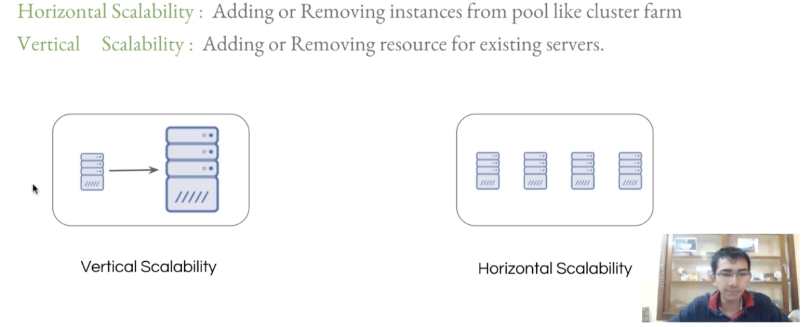

# AWS Cloud Practitioner Course
Start Date: 10/10/19

## Course Overview
- Cloud Computing Conecpts
  - What is Cloud Computing?
  - What does AWS provide?
- AWS Core Services
- AWS Security
- AWS Pricing

---
---
## Lesson Notes
---
### Course 2 - Fundamentals of Cloud Computing Platform
#### Lesson 1 - Introduction to Cloud Computing
Before AWS:

1.
    - Sys Admins had to use a data center and hosting provider
    - You had to rent a server, buy a server, or use a hosting service and pay a monthly fee
2.
    - Then you had to send them you requirements
      - Power backup, cooling, internet connectivity, etc...
      - Which led to how much you would pay

CONS of Data Center and Hosting Providers:
- If there is an issue, you have to physically go to the server and reboot it.
- If you want to scale a Data Center up you need to install a new RAM onto the server
  - With a hosting provider, you need to tell them to do it,  delayed by however fast they are

Power of Cloud Computing:
- Able to change the server capacity within an minute!
  - EX: You have a promotion and need to handle more people going to your server.

3 Important Characteristics of CC (Cloud Computing):
1. On-Demand & Self Served
    - Launch anytime without manual intervention
2. Elasticity
    - You can scale up & down anytime
3. Measured Service
    - Pay what you use

Another CSP (Cloud Service Provider):
- DigitalOcean

### Lesson 2 - Cloud Computing Models
3 Types of CC Models:
1. SaaS (Software)
    - EX: Google Docs, Office 365
2. PaaS (Platform)
    - EX: Google App Engine
    - You just upload your code and the service runs it for you.
3. IaaS (Infrastructure)
    - EX: AWS, Linode, Digital Ocean

Important Notes when choosing a CSP:
- Choose the best option according to your requirements

AWS provides:
- Saas, PaaS, and IaaS
If you use AWS for everything you will lose a lot of money.  
- Sometimes Digital Ocean or Linode is a good alternative

EX: If you want to use a service that ONLY AWS offers, then go with AWS.  However you can launch your servers on Digital Ocean.  Some people have done a Hybrid Cloud Platform by using an AWS SaaS and a Digital Ocean Server.

### Lesson 3 - Architecture of Cloud Environments
"Cloud is not on Clouds" 

Understand the Virtualization Layer!

- Behind the scenes, Cloud is only a data center
- Virtualization is one of the most important aspects of IaaS

Virtualization allows:
- On Demand & Self-Serviced
- Elasticity
- Pay Per Use
- Run multiple OS on a single hardware

Virtualization Softwares:
- VMware Workstation / vSphere
- KVM
- XEN
- VirtualBox

With these Virtualization Softwares you can choose how much memory each VM has depending on your hardware limits

It will help you to understand the Virtualization layer first before moving onto AWS.

### Lesson 4 - On-Demand & Self Service - Characteristics of Cloud
"Cloud is not unlimited"
On Demand Resources:
- A person can provision resources without the need to interact with a human

Challenges:

- Though cloud limits are high, there is still a limit, you will not always be able to launch an instance
- You are limited to the hardware that you have

### Lesson 5 - Characteristic of CSP - Elasticity
"Rubber band"

Elastiity:
- Allows you to add and remove capacity whenever it is needed
  - EX: If you have a promotion and are expecting more people

Capacity:
- Generally refers to processing & memory

Scalability:

- Vertical
  - Adding or removing resources for existing servers
  - EX: Scaling up from a 2GB RAM to 8GB RAM
  - Pros:
    - Databases generally cannot be scaled horizontally, therefore you need to scale vertically.
  - Cons:
    - If you have a promotion and a server goes down, then the whole website will go down
- Horizontal
  - Adding or removing instances from pool like cluster farm
  - EX: Creating 4 new 2GB RAM Servers
  - Pros:
    - Even if one server goes down, you still have other servers running
  - Cons:
    - Usually you can't scale databases (masters) horizontally

Auto-Scalability:
AWS Provides an auto-scaling configuration

EX:  
- When a CPU Load > 70% scale up by two more servers
- When a CPU Load < 30% sclae down by two servers

### Lesson 6 - Elasticity Part 2
Challenges:
- If you want to Vertically Scale, you have to shut down a server first before scaling up
- This challenge is still true with AWS, you cannot vertically scale a server unless you turn it off first

--- 
## Course 3 - Understanding Core AWS Services
### Lesson 1 - Introduction to Amazon Web Services
- There are different places in the world for you to host your AWS server
- Gartner's Magic Quadrant

Pros of AWS:
  - Storage
    - AWS guarantees 99.99999999% durability
  - Pay As You Go Model
    - Allows you to scale resources well
    - Generally based on hourly costs
    - Prices are depending on the types and size of the services that you are using

### Lesson 2 - AWS Global Infrastructure
Overview:
Regions -> Availability Zones -> Data Centers

- If you have an application with multiple servers then you should spread those servers across multiple AZs
- AWS operates on 16 regions with 44 availability zones

Data Centers:
  - Problem: What if a single data center goes down?
    - Then the data will not be able to be accessed however long the data center is down.
    - AWS combats this issue by storing it's data centers in Availability Zones.

Availability Zone (AZ):
- How is it structured?
  - AWS Data Centers are organized into Availibility Zones
  - One AZ can have multiple Data Centers
  - Data is replciated across multiple data centers!
  - Each AZ is located at a lower-risk location
    - They choose locations that are have minimal risk for disaster

- How does this help?
  - If a data center goes down, then there will be another data center where you can access your data

AWS Regions:
  - Each region has at least two AZs
  - There are 16 regions worldwide as of 2017
  - Though AZs are connected to one another, Regions are isolated from one another

Ex: What if we have an application with multiple servers?
- Problem:
  - If we have all servers are in the same AZ then the whole application will go down if that AZ goes down 
- Solution:
  - Spread out the servers across different AZs!!

### Lesson 3 - Setting up Labs
- AWS allows you to have a free account
- I set up my free tier account

### Lesson 4 - Multi-Factor Authentication
[AWS Management Console](https://aws.amazon.com/console/)

Points:
- Be careful with your login because you can be charged a lot of money
- I set up my MFA and Google Authenticator

MultiFactor Authentication (MFA):
- MFA will help ensure your AWS Account's security
- You can use Google Authenticator to get MFA codes

Pros of MFA:
- Even if your Username and Login is compromised the person loggin in still needs to put in a MFA code

### Lesson 5 - Creating our first IAM user

Points:
- I create a new IAM User

Problem:
- Your Root Account allows you to have UNLIMITED access to your AWS resources
- If somebody gets a hold of your root account then they will have unlimited access!

AWS Best Practices:
- In order to ensure security you should create an AWS Identity and Access Management User (IAM)
- IAM Users allow you to restrict the privelages with your account.
- A Root User should not be accessed until it needs to be accessed
  - Many financial institutions create alerts whenever a Root User is logged in.  Ideally you should be using IAM Users until it is necessary to access the Root User

  How to Create an IAM User:
  1. Go To Services -> IAM -> Users
  2. Create a New User
  3. Select Password Options
  4. Set Permissions
  4. b) Add tags (optional)
  5. Review
  6. Finish
    - Given a link to send to a person

  Warning:
  - IAM Users do not have the MFA Option By Default

  Set Up MFA With Your User:
  1. Go To User
  2. Click Security Credentials
  3. Set Up MFA Code

  Permissions:
  - If your IAM is compromised you can immedietely remove the permissions

  ### Lesson 6 -  Setting up MobaXterm

  Warning!:
  - MobaXterm does not work on Mac
  - Need
    - telnet
    - ssh
    - curl

  PuTTY:
  - An alterntive to MobaXTerm

  - I don't have telnet.  I will see if I can get away using it without telnet

  ### Lesson 7  -  Launcing First EC2 Instance
  1. First login to your AWS Managment Console
  2. Select Your Region
  3. Go to the EC2 Dashboard
  4. Go to Instances
    - Create a Keypair
    - Launch Instance
      - Select an OS
        - We choose Amazon Linux
      - Select an Instance
        - How much CPU/Ram do you need?
          - WARNING! If you don't choose a free tier, you will be charged.
      - Configure Instance Details (Default)
      - Add Storage (Default)
      - Add Tags (Default)
      - Configure Security Group
        - Make a Security Group Name
        - This case will be SSH TCP on Port 22
        -   Source 0.0.0.0/0 Means that anybody can access it through Port 22
      - Review and Launch
        - Click Launch and Select your relevant key pair
        - Your instance will now launch though it will take some time for it to instantiate the first time

  Creating an Instance:
  - Before creating an instance we need to create a key pair
  - Amazon gives you options of different OS's, and instances that you can use.
- Once your instance is running, you can open your MobaXTerm

Note:  If you are running Mac or Linux we don't need MobaXTerm because they already have an SSH client installed 

Connect with Telnet:
Use the command "telnet [IP Address] [Port]"

Note:
Can't connect when you're in the Genuent Office because they block SSH.
