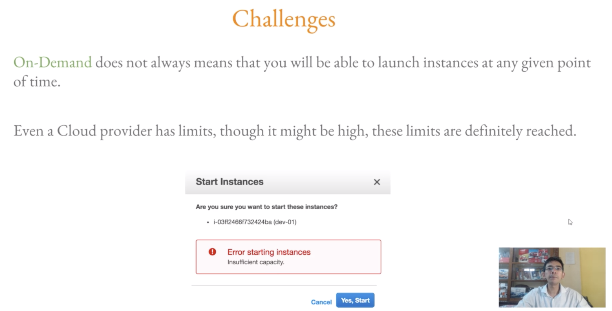
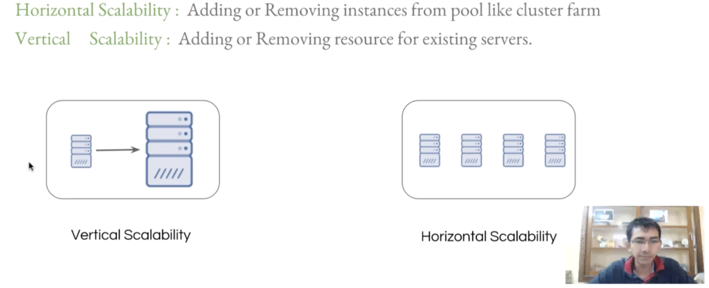

# AWS Cloud Practitioner Course 2
## Fundamentals of Cloud Computing Platform
Start Date: 10/10/19

---
---

## Lesson Notes
---
### Course 2 - Fundamentals of Cloud Computing Platform
#### Lesson 1 - Introduction to Cloud Computing
Before AWS:

1.
    - Sys Admins had to use a data center and hosting provider
    - You had to rent a server, buy a server, or use a hosting service and pay a monthly fee
2.
    - Then you had to send them you requirements
      - Power backup, cooling, internet connectivity, etc...
      - Which led to how much you would pay

CONS of Data Center and Hosting Providers:
- If there is an issue, you have to physically go to the server and reboot it.
- If you want to scale a Data Center up you need to install a new RAM onto the server
  - With a hosting provider, you need to tell them to do it,  delayed by however fast they are

Power of Cloud Computing:
- Able to change the server capacity within an minute!
  - EX: You have a promotion and need to handle more people going to your server.

3 Important Characteristics of CC (Cloud Computing):
1. On-Demand & Self Served
    - Launch anytime without manual intervention
2. Elasticity
    - You can scale up & down anytime
3. Measured Service
    - Pay what you use

Another CSP (Cloud Service Provider):
- DigitalOcean

### Lesson 2 - Cloud Computing Models
3 Types of CC Models:
1. SaaS (Software)
    - EX: Google Docs, Office 365
2. PaaS (Platform)
    - EX: Google App Engine
    - You just upload your code and the service runs it for you.
3. IaaS (Infrastructure)
    - EX: AWS, Linode, Digital Ocean

Important Notes when choosing a CSP:
- Choose the best option according to your requirements

AWS provides:
- Saas, PaaS, and IaaS
If you use AWS for everything you will lose a lot of money.  
- Sometimes Digital Ocean or Linode is a good alternative

EX: If you want to use a service that ONLY AWS offers, then go with AWS.  However you can launch your servers on Digital Ocean.  Some people have done a Hybrid Cloud Platform by using an AWS SaaS and a Digital Ocean Server.

### Lesson 3 - Architecture of Cloud Environments
"Cloud is not on Clouds" 

Understand the Virtualization Layer!

- Behind the scenes, Cloud is only a data center
- Virtualization is one of the most important aspects of IaaS

Virtualization allows:
- On Demand & Self-Serviced
- Elasticity
- Pay Per Use
- Run multiple OS on a single hardware

Virtualization Softwares:
- VMware Workstation / vSphere
- KVM
- XEN
- VirtualBox

With these Virtualization Softwares you can choose how much memory each VM has depending on your hardware limits

It will help you to understand the Virtualization layer first before moving onto AWS.

### Lesson 4 - On-Demand & Self Service - Characteristics of Cloud
"Cloud is not unlimited"
On Demand Resources:
- A person can provision resources without the need to interact with a human

Challenges:

- Though cloud limits are high, there is still a limit, you will not always be able to launch an instance
- You are limited to the hardware that you have

### Lesson 5 - Characteristic of CSP - Elasticity
"Rubber band"

Elastiity:
- Allows you to add and remove capacity whenever it is needed
  - EX: If you have a promotion and are expecting more people

Capacity:
- Generally refers to processing & memory

Scalability:

- Vertical
  - Adding or removing resources for existing servers
  - EX: Scaling up from a 2GB RAM to 8GB RAM
  - Pros:
    - Databases generally cannot be scaled horizontally, therefore you need to scale vertically.
  - Cons:
    - If you have a promotion and a server goes down, then the whole website will go down
- Horizontal
  - Adding or removing instances from pool like cluster farm
  - EX: Creating 4 new 2GB RAM Servers
  - Pros:
    - Even if one server goes down, you still have other servers running
  - Cons:
    - Usually you can't scale databases (masters) horizontally

Auto-Scalability:
AWS Provides an auto-scaling configuration

EX:  
- When a CPU Load > 70% scale up by two more servers
- When a CPU Load < 30% sclae down by two servers

### Lesson 6 - Elasticity Part 2
Challenges:
- If you want to Vertically Scale, you have to shut down a server first before scaling up
- This challenge is still true with AWS, you cannot vertically scale a server unless you turn it off first
