# AWS Cloud Practitioner Course 3
## Understanding Core AWS Services
Start Date: 10/10/19

---

# Lesson Notes
## Course 3 - Understanding Core AWS Services
---
---
### Lesson 1 - Introduction to Amazon Web Services
  - There are different places in the world for you to host your AWS server
  - Gartner's Magic Quadrant

#### Pros of AWS:
  - Storage
    - AWS guarantees 99.99999999% durability
  - Pay As You Go Model
    - Allows you to scale resources well
    - Generally based on hourly costs
    - Prices are depending on the types and size of the services that you are using

---
---
### Lesson 2 - AWS Global Infrastructure
#### Overview:
    Regions -> Availability Zones -> Data Centers

  - If you have an application with multiple servers then you should spread those servers across multiple AZs
  - AWS operates on 16 regions with 44 availability zones

#### Data Centers:
  - Problem: What if a single data center goes down?
    - Then the data will not be able to be accessed however long the data center is down.
    - AWS combats this issue by storing it's data centers in Availability Zones.

#### Availability Zone (AZ):
  - How is it structured?
    - AWS Data Centers are organized into Availibility Zones
    - One AZ can have multiple Data Centers
    - Data is replciated across multiple data centers!
    - Each AZ is located at a lower-risk location
      - They choose locations that are have minimal risk for disaster

  - How does this help?
    - If a data center goes down, then there will be another data center where you can access your data

#### AWS Regions:
  - Each region has at least two AZs
  - There are 16 regions worldwide as of 2017
  - Though AZs are connected to one another, Regions are isolated from one another

#### Ex: What if we have an application with multiple servers?
  - Problem:
    - If we have all servers are in the same AZ then the whole application will go down if that AZ goes down 
  - Solution:
    - Spread out the servers across different AZs!!

---
---
### Lesson 3 - Setting up Labs
  - AWS allows you to have a free account
  - I set up my free tier account

---
---
### Lesson 4 - Multi-Factor Authentication
  [AWS Management Console](https://aws.amazon.com/console/)

#### Points:
  - Be careful with your login because you can be charged a lot of money
  - I set up my MFA and Google Authenticator

#### MultiFactor Authentication (MFA):
  - MFA will help ensure your AWS Account's security
  - You can use Google Authenticator to get MFA codes

#### Pros of MFA:
  - Even if your Username and Login is compromised the person loggin in still needs to put in a MFA code

---
---
### Lesson 5 - Creating our first IAM user

#### Points:
  - I create a new IAM User

#### Problem:
  - Your Root Account allows you to have UNLIMITED access to your AWS resources
  - If somebody gets a hold of your root account then they will have unlimited access!

#### AWS Best Practices:
  - In order to ensure security you should create an AWS Identity and Access Management User (IAM)
  - IAM Users allow you to restrict the privelages with your account.
  - A Root User should not be accessed until it needs to be accessed
    - Many financial institutions create alerts whenever a Root User is logged in.  Ideally you should be using IAM Users until it is necessary to access the Root User

#### How to Create an IAM User:
  1. Go To Services -> IAM -> Users
  2. Create a New User
  3. Select Password Options
  4. Set Permissions
      - b) Add tags (optional)
  5. Review
  6. Finish
      - Given a link to send to a person

#### Warning:
- IAM Users do not have the MFA Option By Default

#### Set Up MFA With Your User:
  1. Go To User
  2. Click Security Credentials
  3. Set Up MFA Code

#### Permissions:
  - If your IAM is compromised you can immedietely remove the permissions

---
---
### Lesson 6 -  Setting up MobaXterm

#### Warning!:
  - MobaXterm does not work on Mac
  - Need
    - telnet
    - ssh
    - curl

#### PuTTY:
  - An alterntive to MobaXTerm

  - I don't have telnet.  I will see if I can get away using it without telnet

---
---
### Lesson 7  -  Launcing First EC2 Instance
  1. First login to your AWS Managment Console
  2. Select Your Region
  3. Go to the EC2 Dashboard
  4. Go to Instances
      - Create a Keypair
      - Launch Instance
        - Select an OS
          - We choose Amazon Linux
        - Select an Instance
          - How much CPU/Ram do you need?
            - WARNING! If you don't choose a free tier, you will be charged.
        - Configure Instance Details (Default)
        - Add Storage (Default)
        - Add Tags (Default)
        - Configure Security Group
          - Make a Security Group Name
          - This case will be SSH TCP on Port 22
          -   Source 0.0.0.0/0 Means that anybody can access it through Port 22
        - Review and Launch
          - Click Launch and Select your relevant key pair
          - Your instance will now launch though it will take some time for it to instantiate the first time

#### Creating an Instance:
  - Before creating an instance we need to create a key pair
  - Amazon gives you options of different OS's, and instances that you can use.
  - Once your instance is running, you can open your MobaXTerm

  Note:  If you are running Mac or Linux we don't need MobaXTerm because they already have an SSH client installed 

  Connect with Telnet:
  Use the command "telnet [IP Address] [Port]"

  Note:
  Can't connect when you're in the Genuent Office because they block SSH.

#### Connect to Instance
  Now that we've created our instance, let's connect to it.

  IP Address Section of Instance:
  - Private IP
    - Won't be able to connect directly
    - Need a Virtual Private Network
  - Public
    - In our case it's IPv4
    - We will use this to connect 

  1. Open up iTerm/ MobaXTerm
      - telnet [IP] [PORT]
      - In order to quit hit CTRL+]

  2. Connect Via SSH
      - Use command:  
      
            ssh ec2-user@[IP]
      - You should get "Permission Denied (publickey)"
      - I get when at home:
      The authenticity of host '[IP] ([IP])' can't be established.
      ECDSA key fingerprint is [FINGERPRINT]

  3. Add key to desktop for SSH
      1. Put Key .pem on desktop
      2. Go into Desktop

              cd ~/Desktop
      3. Change permission 
          
              chmod 640 [KEY FILE NAME]
          - I had to change the permissions manually
      4. Run ssh command with key
          
              ssh -i ~/Desktop/[KEY FILE NAME] ec2-user@[IP]
      5. Now that you're in go into the root account
          
              sudo su -

  4. Download nginx
      - This is a web server similar to Apache
      1. Command:
          
              yum -y install nginx
      2. Check status:
          
              service nginx status
      3. Start server:
          
              service nginx start
      4. Check whic port it is running on:
          
              -netstat -ntlp
          - Check where it says nginx and make sure the state is listening
          - Then check the port
          - In my case it is [NGINX PORT]

  5. Try to connect via telnet
      - If you try to connect via telnet to the port it will not be running
      - Check the Security Group "view inbound rules" in the EC2 Management Console
      
        - You should see that there is only one rule for SSH

  6. Add a new inbound rule
      
      
      1. Click Security Group name
      2. Click "inbound" then "edit" 
      3. Add rule
          - Include Port
          - Change name to "Web Server" in the description

      4. Now you should be able to connect to the Web Server

  7. Copy IP Address and open it in a web browser
      - You should see "Welcome to nginx..."

  8. We can edit the html page
      - In the SSH root window go into the file that holds the html files
        
            cd /usr/share/nginx/html
      - The web page is being rendered from the index.html file
      - View file
        
            nano index.html
      - Clear file
            
            echo > index.html
      - Write new file
        - For now we will write
          - "Welcome to my websites..."
        - Use CRTL+X to exit
          - It will ask you to save
            - Press Y
            - Then press Enter
      - Refresh page to check if the new message is there

---
---
### Lesson 8  -  Document - Installation Commands
  Amazon has come up with the new Amazon Linux 2 OS.

  If you are using Amazon Linux 2, the commands to install nginx will slightly change. Here are the new updated commands:

      amazon-linux-extras install nginx1.12
      systemctl start nginx

---
---
### Lesson 9  -  Understanding Basics of Firewall
  There are good guys and bad guys on the internet.
  Because of this we need to protect our servers.
  This is why we have firewalls

  

#### Firewalls
  - Firewalls allows us to 
    - Allow Trusted users
    - Block hackers

#### Example
  In this example, we have 5 services running:
  - Apache, SSH, FTP, SMTP, and MySQL

  Each of these Services also have a Port affiliated with them.

  In the firewall rule(bottom of image) it states the firewall will only allow a connection from:
  - Port 22
  - With the Source 10.0.5.57
  - WIth a request for SSH

  

  In this example you can see the Authorized User (IP:10.0.5.57) and the Hacker (IP:112.20.50.60)

  
  Since the Source is specified in the firewall rules, the hacker will be blocked

#### 3 Way Handshake
  
  - A 3 way handshake needs to happen before you can start accessing data
  - The TCPI/IP Header Fields are looked at first in the "Packet" that is sent
  - What does the firewall evaluate the TCP/IP Header Fields?
    - The most important things that it looks at are the:
      - Source IP and PORT
      - Destination IP and PORT
    - Based on these coniditions the Firewall will determine if it will allow the transaction
      - In the backend it goes into more detail (This is just a high-level overview)

#### Example:
  In this example since the ports are different (as you can see in the TCP/IP Packet)

  This request will be blocked!!
  
  - Notice that the Source IP matches: 10.0.5.57
  - But the Destination Port does not match: 80

  As soon as a machine sends a packet:
    1. It Goes to the Firewall (SYN Packet)
        - Checks source IP
        - Check the Destination Port
    2. The data transfer takes place if passed

#### Firewall Final
  - If there are no rules on a firewall it will block every request
  - Firewalls block thousands of attacks everyday. 

---
---
### Lesson 10  -  Network ACL
"Multiple Layers of Defense"
#### Network ACL Overview:
  - Stateless in Nature
  - Operate at the Subnet level
    - Subnet vs Instance
      
      - Subnet can contain hundreds of instances
    - Instead of the Instance level where Security Groups are
  - All subnets in VPC must be associated with NACL
    - AWS will create a new NACL when you make a VPC by default
    - By default, network ACL contains full allow inbound and outbound

#### Example:
  
  - NACL allows you to block an IP at the NACL level.
  - You can't block only one IP on the Security Group

#### Use NACL
  1. Go to VPC Console
  2. Select a VPC
    - In my case, I only have one
  3. Go to Network ACLs
    - Example shows Default Yes and Subnets:
    
  4. Check Inbound and Outbound Rules
    - You should have two rules each
    
    - The lower the # of the rules, the higher the priority
      - Rule #99 is higher priority than #100
      
      - Rule #101 is lower priority than #100
      
    - If you create a custom NACL it comes default with all traffic denied
    

---
---
### Lesson 11 -  Introduction to Block vs Object Storage Mechanism
#### Block Storage
  - Data is stored in "blocks"
  - Data stored is read or written a whole block at a time
  - Most file systems are block devices
  - Every block has an address
    - An app can be called via SCSI call using address
  - No storage side meta-data associated with the block other than the address
  - A block has no description and no owner

##### View Block Size
  - Go into root of EC2 instance:

        sudo su -
  -  View block size:

          blockdev --getbsz /dev/sda
  - List devices

        lsblk
    -  In my case I get an "xvda"

##### Example
  - Based on the block size of 4096:
    - Each block is 4096 based blocks
  - If you have data of 8KB (8096) 
    - You will have two blocks
  - If you have data of 12KB 
    - You will have three blocks

---
#### Object Storage
  - Data storage architecture that manages data as objects as opposed to blocks of storage
  - Defined as data (a file) along with all it's meta-data as an object
  - Object is given an ID which is calculated from the contents (object and meta-data)
    - An app can call an object based off the unique Object ID

##### Meta Data
  - By default AWS adds the Content-Type meta data to an object
    - Ex: image/png

---
#### Block vs Object Storage
##### Differences
  
    - Object Storage can be called via API
      - On a HTTP(S) based interface

---
---
### Lesson 12 - Instance Store Volumes
"temporary data"
#### Instance Store (IS)
  - AWS Instance store provides a temporary block storage volumes for use wuth EC2 instances
    - Usually when you reboot an instance, the data in a system is lost
  - Storage is located on the disks that are physically attached to the host computer
  - Size on instance store varies depending on the instance
  - Instance store is temporary storage
    - Our first instance was an ebs device type which is a permanent storage, a proper hard disk 
#### Example
  
  - Using 4 VMs belonging to 4 customers
  - We are using the storage device on a host server
  - Problem, if the storage device files, then all 4 VMs will fail.  NOT OPTIMAL

#### Launch an Instance Store
  1. Go to EC2 Instances
  2. Launch a new instance
  3. Choose Community AMIs
  4. Select "Root Device Type" = Instance Store 
  5. We'll choose the first one:
    
  6. Select m1.small type
    
    - Notice that you can't select any of the EBS only instane storages
    - Our m1.small instance has 1.7GB RAM and 160GBs storage size
    - This instance is free, this is why people use instance stores
  7. Configure instance details
    - Use default
  8. Add storage
    - Click "add new volume"
    - Choose "instance store 0"
    - Notice that you can't modify the size because this is determined by the instance type you choose
    
    
  9. Review and launch!
    
    
    - Notice the warning, but you should be fine
    - Select the default key pair
    - Acknowledge the warning
  10. Go to instance and rename "instance store"
    
    
    - Notice that the "Root device type is an instance store
    

#### Important Points
  - Data in IS is lost when:
    - The underlying disk drive fails
    - The instance stops
    - The instance terminates
  - IS are included in the cost of EC2 instance
    - They are cost effective!
    - Since we already have our EC2 instance we get a free Instance store 
      - With our m1.small we get a free 160GBs
  - If you are using an IS, make sure that you backup your data to central storage
    - Store it in something like an S3

#### Connect to Instance store
  - Telnet to Port 22
  - ssh to the Instance
  
  - Go to root

        sudo su -
  - df -h
    
    - Notice the ephemera
      - This means temporary
  - Create a file
     
  - Reboot IS
    - Notice that you can only reboot or terminate the instance store
     

#### Important Point
##### Before stopping instanes make sure that they are not Instance Stores because you will lose all the data!
  - If you manually halt an IS it will say that it's terminated
     

    
---
---
### Lesson 13  -  Introduction to Elastic Block Store
#### Elastic Block Store (EBS)
  - "Portal Hard Disk"
  -  AWS EBS is a persistent block storage volumes for use with EC2
      - Unlike Instance Stores, the data stored here is saved even when EC2 instances are stopped or restarted
  - Each EBS is designed for 99.999% availability
  - Automatically replicated within its availability zone
  - EBS is elastic in nature  
    - Supports dynamic increase in capacity and performance
    - Can change instance types of live volumes

#### Diagram
  
  - There are 4 EC2 Instances (orange)
    - Without EBS, the EC2 Instances would have to store data directly on the server

  - EBS is similar to a network attached storage (right)
    - There are 3 hard disk drives (black)
    - Mounted via network
    - Devices are replicated to each other
      - Allows data to be backed up

#### Compute !== Storage
##### Compute
  - EC2 is regarded a a compute based service
  - Compute generally refers to Memory & CPU
##### Storage
  - Includes EBS, Instance Stores, etc.

---
#### Practical
  1. Go to your instance

  2. Notice the Root Device Type = ebs

  3. Click Root Device: /dev/xvda

  4. Click Volume ID: (EBS ID)
  

  5. It should take you to the Volume where you can view the
      - Size, Volume Type, # of IOPS

  6. Click Actions and modify volume
      - Note: remember that EBS are elastic
        - This is where you change that stuff
    

  7. Here we can change the size and volume type
      - Size
    

      - Volume Type
    

---
#### Warnings
  - Even though EBS data is backed up, you should still back up the data yourself

---
---
### Lesson 14  -  Features of EBS - Portability
#### EBS Review
  - "Elastic Block Store"
  - Based on Network attached storage
  - Two types of storage
    - Instance Store
      - Storage is directly on host where VM's reside
    - EBS
      - In a cluster that are mounted to EC2 Instances
  - Easily detached and provide portability
    - Because it is attached via network
    - Similar to a hard drive connected via usb
  

#### EBS Portability
  - "Portal Hard Disk"

---
#### Practical 
  1. Go to EC2 Instances 
  2. Go to Volumes
  3. Create a new Volume
  
  4. Set size to 5 GBs
  5. Check Availability Zone for the instance that you're going to connect with
  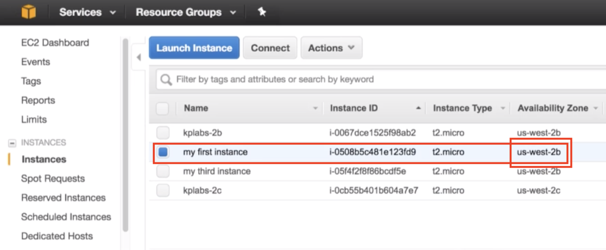
  6. Set the appropriate availability zone
  
  7. Click Create Volume
  8. Notice that state says "available"
      - This means that it is ready to be connected to an EC2 Instance
  
  9. Name the volume "portable"
  
  10. Connect to EC2 Instance

          ssh -i [token route] ec2-user@[IP]
  
  11. Go to Root

          sudo su - 
  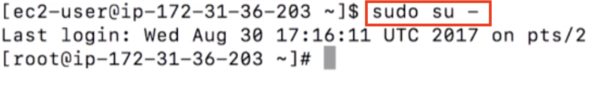
  12. Notice it is attached to XVDA
      
  - Also notice that xvda is listed as the root and block device
  
  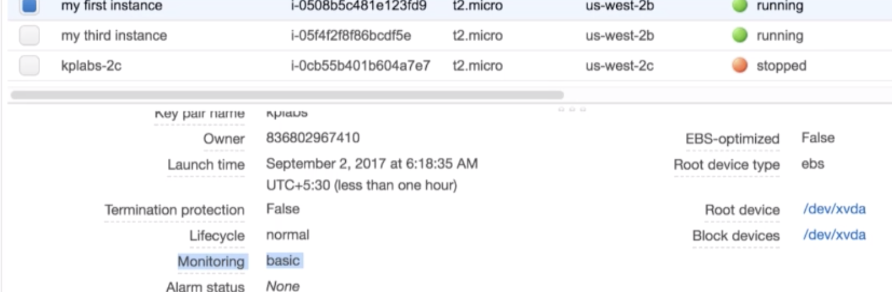
  13. Attach a volume
  
  14. Select Appropriate Instance
  
  15. Go back to instance and confirm that a new block device "sdf" is attached
  

      - Notice that now there is an xvdf
      
  16. Format xvdf disk with a ext4 system

          mkfs.ext4 /dev/xvdf
      - Creates a filesystem inside the xvdf hard disk drive
      
  17. Connect to a specific directory
      - Create new directory

            mkdir /marantz
      - Connect harddisk drive to the folder

            mount /dev/xvdf /marantz
      - ensure /dev/xvdf is connected to your folder
      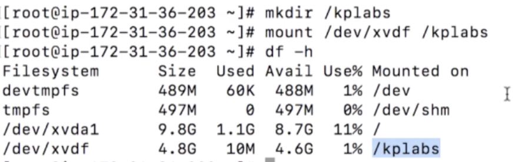
  18. View the folder and list contents
      - Go in folder and list

            cd /marantz
            ls
      - by default it will say lost+found
      
  19. Create a text file in the folder

          touch marantz.txt
          echo "This is EBS Portability example" > marantz.txt
          cat marantz.txt
      
  20. Create a second instance
      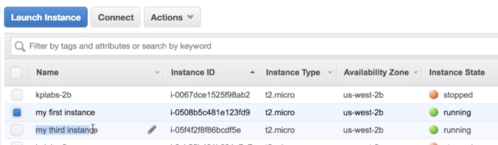
  21. Disconnect from your first instance and connect to your second instance
      - Step out of folder, unmount it, and confirm it's not in the file system
        - Notive that xvdf is not longer listed in the directory

            cd ..
            umount /marantz
            df -h
      
  22. Detach volume from the instance and wait for it to be available
      
      
  23. Now that it's available we can attach to the new EC2 Instance
      
      - Confirm that the sdf block device is there
        - DISCLAIMER: The instance has to have the same availability zone
      
      - Notice that is no longer in the old instance
      
  24. Check to see if file is in new instance

          ssh -i ~[key route] ec2-user@[IP]
          sudo su -
      

          lsblk
          mkdir /marantz02
          mount /dev/xvdf /marantz02
          df -h
      

          cd /marantz02
          ls
          cat kplabs.txt
      

---
---
### Lesson 15  -  Introduction to ELB
"Managed Services are the best
#### Elastic Load Balancer (ELB)
  - Businesses like to have backups just in case a server goes down
  - ELB takes a part in this architecture
  - Single point of failure should be avoided
    - In this image the cirle would be the load balancer
    - If the single load balancer goes down, the whole website will go down
      
  - Two Load balancers are better and was more common in business architecture before ELB
    - Even if one load balancer goes, the other one can be used
      
  - Instead of running load balancers on the EC2 Instances, we utilize ELB which AWS provides
    - Scale automatically depending on the load
    - Managed by AWS
      - AWS also provides Application Load Balancers and Network Load Balancers
      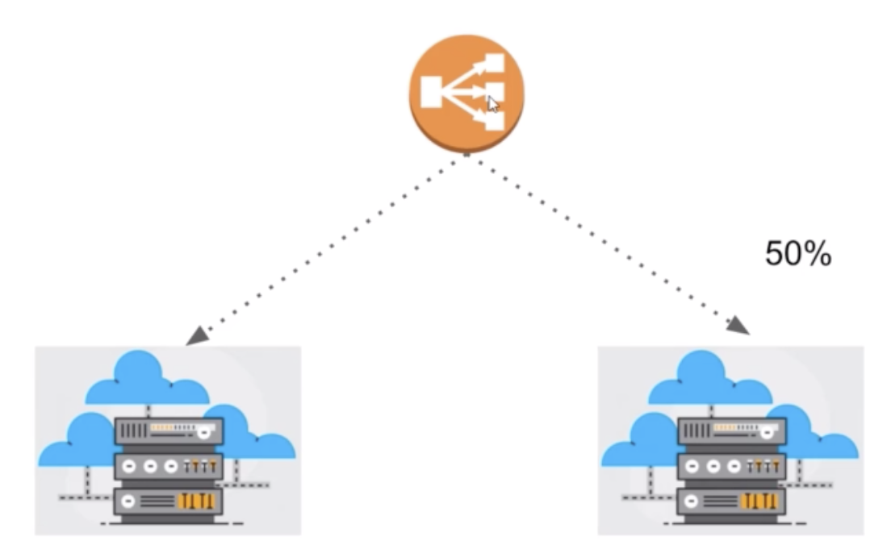

#### Intro to ELB Overview
  - ALlows us to distribute incoming traffic to multiple EC2 Instances
  - ELB can handle rapid change in network traffic patterns
  - Since it's a managed service, clients don't have to worry about high availability related aspects
    
---
#### Practical
 1. Have two instances both installed with nginx
      - Nginx is not installed on the second instance so I need to do that
      
      - To check if both of your instances have nginx installed and running, copy the IP and go to it on a browser.
        - You should see for both IPs:
      
  2. Go to the Load Balancer section
      
      - If you go to the load balancer, you will see that both of the instances are connected to the load balancer:
      - Also notice that both of the instances status are "inService"
      
  3. Copy the DNS name in the ELB Description:
      
      - Copy it and put it in the browser.
        - The first time you will see one server:
      
        - When you refresh it will show the other server:
      
        - This will flip flop back and forth. Sending requests to both of the servers
  4. Let's test if one server goes down:
      - Stop one of the instances:
      
      - Once it is stopped:
      
      - If you refresh, the link will only stay on one server

#### Overview
  - For testing purposes, we showed server one and server two to be different
  - Typically the servers will be showing the same thing
  - If we go back to ELB menu we can see that one of the instances status is "OutOfService":
      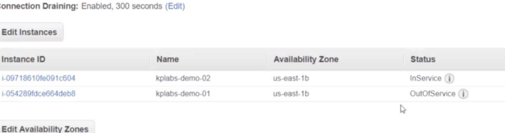

---
---
### Lesson 16  -  Creating our first Elastic Load Balancer
#### Practical 
  1. Go to Load balancer page and Create Load Balancer 
      
  2. There are multiple options but for now we want the simple "Classic Load Balancer"
      
  3. Give your load balancer a name and ensure that the Load Balancer and Instance Port is 80 (where your nginx port is)
      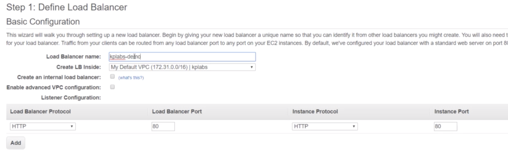
  4. Select the default Security Group
      
  5. Ensure that the Ping Path is looking at the index.html
      - If you the file you want to look at is not index.html, change it
      
  6. Select two instances that you want to connect to
      - If you don't have instances, create 2 new ones
        - Install nginx on both servers
          - Refer to previous tutorial Lesson 7
      - You need to make sure that you have 2 running instances first
      
  7. Review and Create
  8. Go to Load balancer
      
  9. Notice that if you have two instances that are OutOfService, this means that they are still registering
      - Wait until it says inService
      
  10. Go to Load Balancer Description and copy the DNS Name and put it in a browser
      
  11. The first time it should go to one server
      
        - The Next time it should go to the other server
      
        - For some reason mine is not working

---
---
### Lesson 17 - Resource Level Tags
"Tag Strategies"

#### Overview
  - If we go over to our Instane Tags, notice that we only have one tag
      
    - This is not typical for an enterprise level
      - For enterprises, good tags are extremely important

#### Example
  - If a CFO wants to know how much resources a certain team is using and seeing how much each team is being charged
  - good tags will make it possible for the CFO to see who is working on what
  - An example of some tags that some teams and use is:
      

#### Practical 
 1. Add a tag to one of your instances with: 
 
        team : payments
      
 2. Add a tag to another instances with: 
 
        team : devops
      
  - If you have proper biling setup, you can look into how much money it has cost for resources linked to a specific tag
    - To do this, you need to enable the billing to include tagging related information
  3. Go to My Billing Dashboard
      
  4. Go to Preferences and enable Receive Billing Reports
      
      - Now we need the S3 bucket name
  5. Go to S3 Services, preferably in new tab
      
  6. Create new Bucket
      - Give it a name and create the bucket
      
  7. Add bucket to billing preferences and click sample policy
      
      - Copy the policy
      
  8. Put Policy in the S3 Bucket
      - Go to bucket properties
      
      - Go to Permissions -> Bucket Policy
        - Paste the Policy in the editor and save
      
      - Verify the bucket
      
  9. Manage report tags
      
        - Activate the tags that you want to track
      
  10. Go back to preferences and save them
      
  - Now whenever data is updated on the S3 you will get information about the tags

#### Overview
  - With effective tags, you can easily be able to target and view exactly what teams are costing and using

---
---
### Lesson 18 - Detailed Billing Report with Tags
#### Overview
  - Verify that you have confirmed the Detailed Billing reports with resources and tags
    - NOTICE that this is now a legacy feature, and this is not part of the current AWS
      
  - This is something that a Solutions Architect should know!!

#### Practical
  1. Go to the S3 Bucket that you creaded
      
  2. Notice that AWS has given you reports for various months
      
  3. Download and view the notes
      - Notice that there is a LOT of information
      
      - The last column has the tags that you created
      
      
  
---
---
### Lesson 19 - Auto Scaling
"Scaling to Traffic Patterns"

#### Overview
  - Scalability is the ability of a system to change in size depending on the needs
  - Infrastructure should scale to support changing traffic patterns
  - Ideal architecture should have less servers when traffic is less and vice-versa

#### Example
  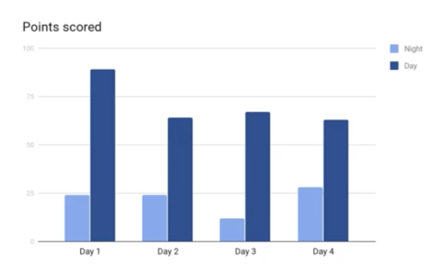
  - If you have high traffic during the day and less during the night then you should scale down during these times
  - For example if you have 5 servers during the day, then it would be a waste of these resources if you have these running the whole day

---
#### Auto Scaling 
  - Auto scaling allows us to scale up and down the EC2 instances depeneding on conditions that are defined by the solutions architect
  - If we define a minimum of 1 instance and one of those instances is terminated then another instance will take it's place

##### How is it achieved?
- Based off the average load of the instance
  
  - Simple Scaling Policy
  - Base instance level: 2 servers
  - Scalable

##### Check you autoscaling
  1. Go to Auto Scaling Groups
  
  2. Notice
      - Minimum Servers is 1
      - Maximum Servers are 3
      - There are two scaling policies
  
  3. Go to CloudWatch service
      - Go to Alarms
      - Notice that he has two alarms
  
      - One of the alarms will go off if the CPU Utilization is less than 25%
      - THe other will alarm if the CPU Utilization is more than 70%
  
      - We use these alarms alarms in conjunction with the scaling policies

---
---
### Lesson 20 - Introduction to S3
"Unlimited Storage"

#### Overview
  - AWS Simple Storage Service
  - Benefits of S3
    - No need to hire storage admins
    - Don't have to invest in huge storage devices 
    - Don't have to worry about security for the storage servers        

#### Example
  - Storage Capacity
  
    - Everyday 200GB of logs are made
      - What is the most effective way to handle this storage capacity
    - Old Approach
      - Buy huge storage devices
      - Ensure high availability
      - Hire storage admins
      - Ensure security for storage users
      
    - New Approach
      - Create an AWS Account
      - Upload all log files to AWS S3
  - Some other options for storage
    - Mediafire
      - Cheap
      - But doesn't have as many featues
      

#### Intro
  - AWS S3 is an object storage designed to store and retrieve any amount of data from anywhere
  - Designed for 99.999999999% durability and 99.99% availability
  - Comes preloaded with features
      
    - This is what makes AWS S3 so powerful!!

#### Terminology

  
  - Two important terminologies
    - Buckets (AWSLogs)
    - Objects (openvpn sg.png)

#### Practical
  1. Go to S3 Services
  
  2. Click into bucket to check what's inside
  
  3. Go back to S3 Services and Create bucket
      - Note that the bucket names are shared across everybody with an AWS account so not all names will be available
      - In this case "test" is not available
  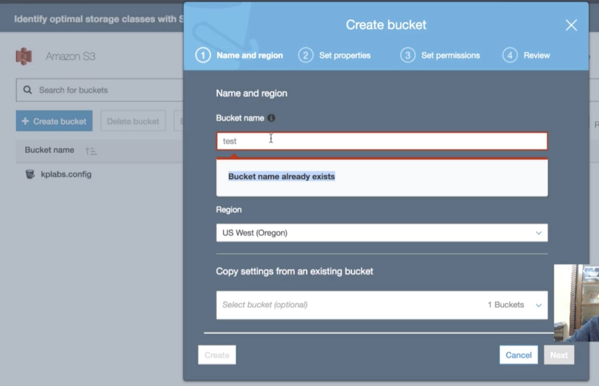
      - Select Name and Region then click Create
  
  4. Go to your newly created Bucket
    
  5. Click on upload then Add files
    
      - In this case we'll add a txt file
    
  6. Click on upload
    
      - Notice that upload will start on the bottom
    
      - And success once it is uploaded
    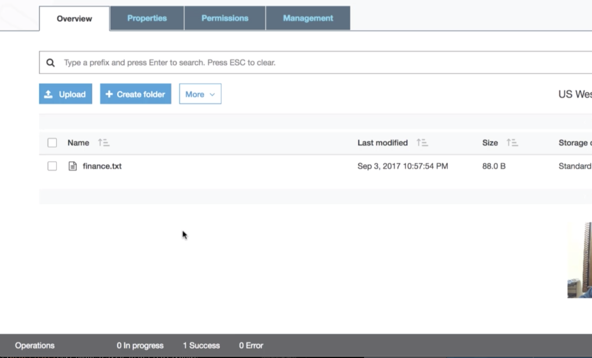
  7. Click inside file
      - Notice the details included in the file
    
  8. You can open the file and view it directly on the browser
    
    

#### Reminder
  - The bucket names have to unique
    - Not the folders though

---
---
### Lesson 21 - S3 - Public Access Settings

#### Overview
  - You can release a public S3 bucket if you want to.

#### Practical
  1. Create a bucket
  2. Put an image or something in it.
  3. Now try to make it public in actions tab
  
  4. Notice that it failed to make it public
      - This is because there is a policy in the bucket that you need to change in the settings
  
  5. Change permissions in "Public Access Settings"
      - Deselect the three boxes, save, and confirm
  
  6. Now when you try to make it public it will work!

---
---
### Lesson 22 - S3 Storage Classes